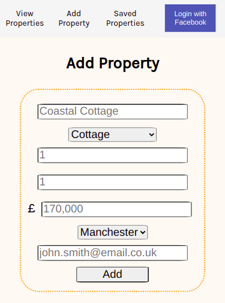

# Surreal Estate

A property search engine similar to RightMove or Zoopla. Users can sign in with facebook and sign out by clicking the blue button in the top right corner. Users can view the list of properties and then filter the properties using the sidebar. They can search by title, sort by city, price ascending, and price descending. They can also save properties. By clicking "Saved Properties", users can view saved properties and remove properties "Saved Properties."

## Motivation

This app was built as part of my coursework at Manchester Codes. I practiced using React, useState, useEffect, and useContext.

## Desktop Version:

## Mobile Version:

## How to use:

After cloning the app using `$git clone git@github.com:sgcook/tech-test-test.git`\

Run these commands in the terminal:\
`$npm install` to install code dependencies\
`$npm start` to start the app in the browser\
`$npm test` to test the app

## API

To run the API locally: [click link and follow the repo's README.md](https://github.com/MCRcodes/surreal-estate-api)

### Built with:

- React (Front-end framework)
- React Testing Libray (Testing Library)
- Jest (Testing library)
- Axios (Making HTTP requests to the API)
- PropTypes (Checking proptypes in React)
- Font Awesome Icons (Adding icons)

### Dev dependencies:

- Prettier
- Eslint

## If more time...

- Separate "loading" and "no saved properties" on the Saved Properties page
- Only allow users to view saved properties once they are signed in
- Make sidebar collapsible

Author: Sara Cook
