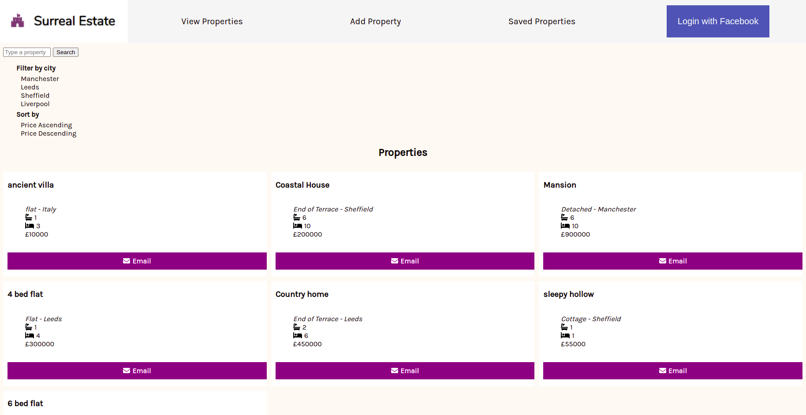

# Surreal Estate

A property search engine similar to RightMove or Zoopla.

## Motivation

This app was built as part of my coursework at Manchester Codes. I practiced using React, useState, useEffect, and useContext.

## Desktop Version:

## Mobile Version:

## How to use:

After cloning the app using `$git clone git@github.com:sgcook/tech-test-test.git`\

Run these commands in the terminal:\
`$npm install` to install code dependencies\
`$npm start` to start the app in the browser\
`$npm test` to test the app

## API

To run the API locally: [click link and follow the repo's README.md](https://github.com/MCRcodes/surreal-estate-api)

### Built with:

- React (Front-end framework)
- React Testing Libray (Testing Library)
- Jest (Testing library)
- Axios (Making HTTP requests to the API)
- PropTypes (Checking proptypes in React)
- Font Awesome Icons (Adding icons)

### Dev dependencies:

- Prettier
- Eslint

## If more time...

- Separate "loading" and "no saved properties" on the Saved Properties page
- Remove bug of being able to save properties twice

Author: Sara Cook
